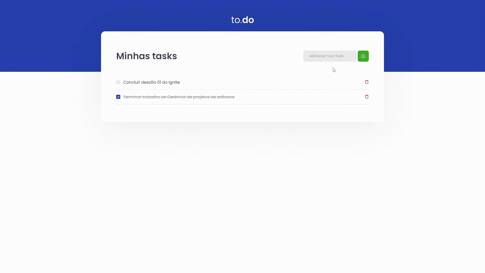

<h1 align='center'>
Desafio 01 - Ignite (Rocketseat)
</h1>

    

<h2>Para testar o app localmente, siga os seguintes passos:</h2>

- Clonar o respositório (git clone)
- Instalar as dependências do projeto (yarn)
- Executar o app (yarn dev)
- Acessar o app via navegador no endereço http://localhost:8080
